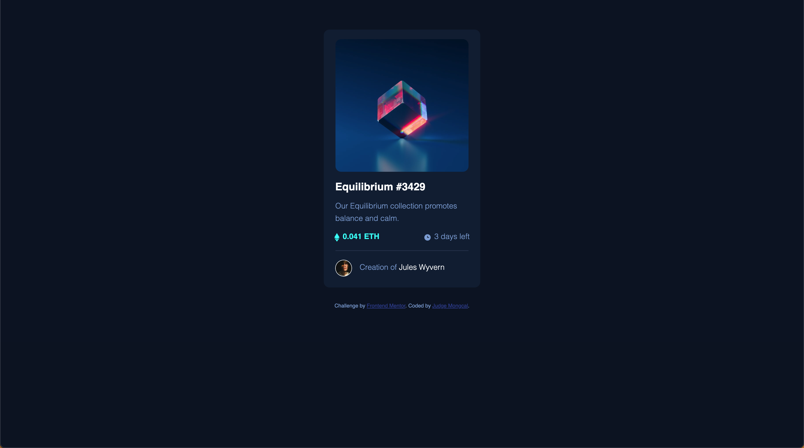
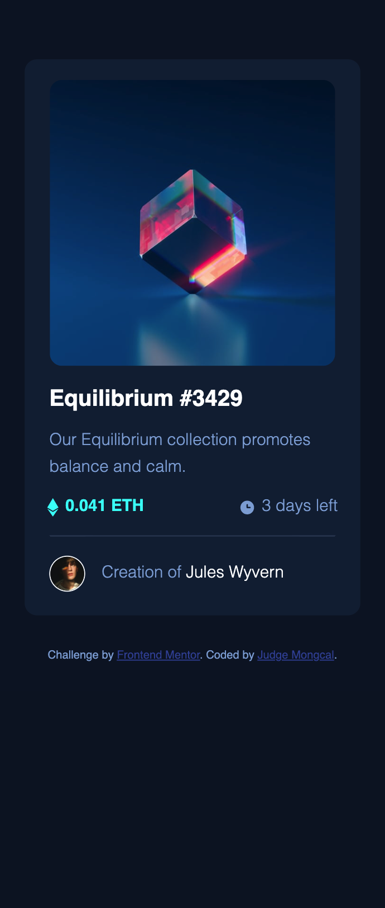

# frontend-project-nft-card
 NFT Card preview component built with HTML and CSS.

## Table of contents

- [Overview](#overview)
  - [The challenge](#the-challenge)
  - [Screenshot](#screenshot)
  - [Links](#links)
- [My process](#my-process)
  - [Built with](#built-with)
  - [What I learned](#what-i-learned)
  - [Continued development](#continued-development)
- [Author](#author)

**Note: Delete this note and update the table of contents based on what sections you keep.**

## Overview

### The challenge

Users should be able to:

- View the optimal layout depending on their device's screen size
- See hover states for interactive elements

### Screenshot

 

### Links

- Solution URL: [https://github.com/judgemongcal/frontend-project-nft-card]
- Live Site URL: [https://singular-paprenjak-245237.netlify.app]

## My process

My process started with coding all the HTML elements necessary for this project one by one, and styling them with CSS to allow myself to focus on completing one area of the design before I move on with the next one (divide and conquer approach). This structure is also applied in writing CSS, to allow for other people to easily navigate the code. 

### Built with

- Semantic HTML5 markup
- CSS custom properties
- Flexbox
- Mobile-first workflow
- Google Fonts

### What I learned

Plain CSS is such a powerful tool in creating great design but it is essential to keep on improving how we code in order to make the project more efficient. I honestly felt like I used more lines of code than necessary to complete this challenge but that's the thing about learning how to code better - you have to code badly first and pin point areas where you can improve on.

### Continued development

For the next projects, I am looking forward to creating designs that are more responsive by using em, rem, and the likes rather than px. I will continue on getting myself used to designing mobile-first and other CSS frameworks whenever applicable. Lastly, adding Javascript to the upcoming projects will be essential for me to be more comfortable using it for more complex projects. Applying UX principles would also be a great addition for the upcoming projects.

## Author

- LinkedIn - [@judgemongcal](https://www.linkedin.com/in/judgemongcal/)
- Frontend Mentor - [@judgemongcal](https://www.frontendmentor.io/profile/judgemongcal)

